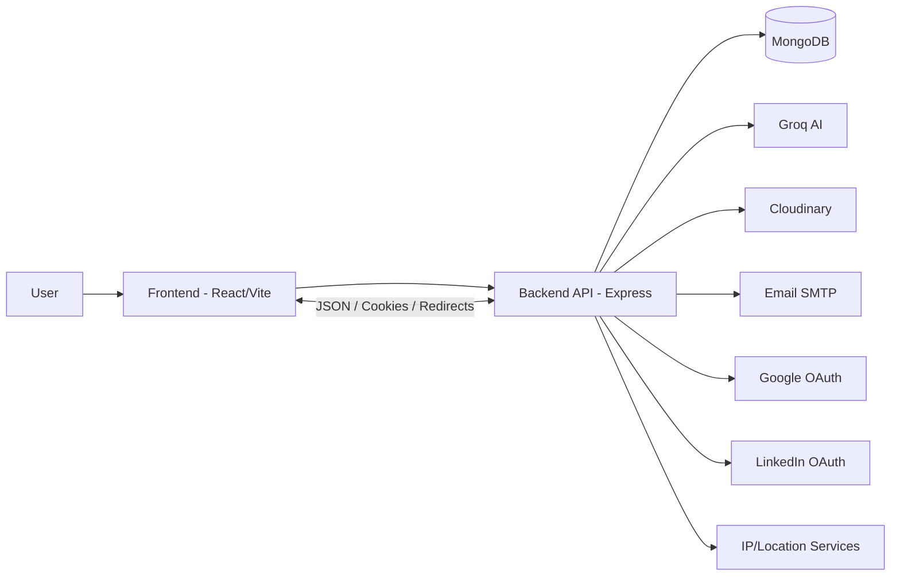
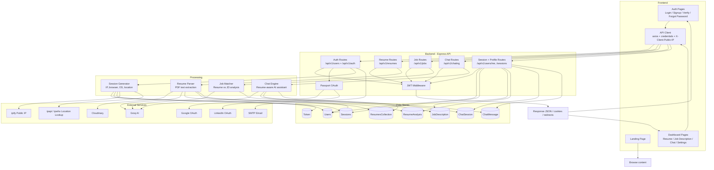

# ResumeSaathi Data Flow Diagram

## Level 0 Overview

## Level 1 Core Application Flows

## Main User Journeys

1. Landing and auth: the user opens the React frontend, signs up or logs in, and the backend creates a session cookie plus profile data.
2. Resume upload: the dashboard uploads a PDF resume, the backend parses it, stores the file and extracted data, sends it to Groq for analysis, then saves the analysis in MongoDB.
3. Job description analysis: the user submits a JD, the backend compares it with the stored resume and saves the match results for later viewing.
4. Chat assistant: the user chats from the dashboard, and the backend combines the current message, prior chat history, and resume text to generate a resume-aware AI response.
5. Sessions and settings: the user can list or revoke sessions, change passwords, and manage account state through authenticated user routes.