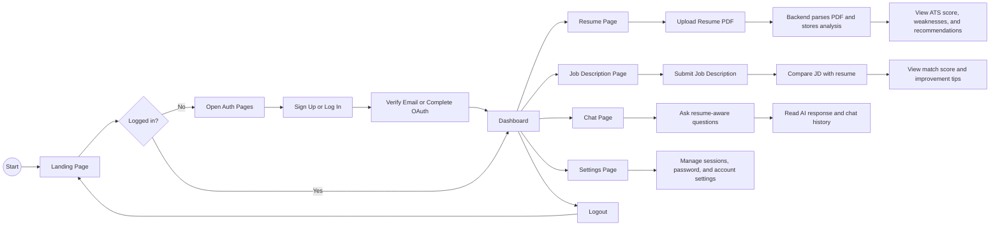

# ResumeSaathi User Flow Diagram

```mermaid
flowchart LR
  S((Start)) --> L[Landing Page]
  L --> Q{Logged in?}

  Q -- No --> A1[Open Auth Pages]
  A1 --> A2[Sign Up or Log In]
  A2 --> A3[Verify Email or Complete OAuth]
  A3 --> D[Dashboard]

  Q -- Yes --> D[Dashboard]

  D --> R1[Resume Page]
  R1 --> R2[Upload Resume PDF]
  R2 --> R3[Backend parses PDF and stores analysis]
  R3 --> R4[View ATS score, weaknesses, and recommendations]

  D --> J1[Job Description Page]
  J1 --> J2[Submit Job Description]
  J2 --> J3[Compare JD with resume]
  J3 --> J4[View match score and improvement tips]

  D --> C1[Chat Page]
  C1 --> C2[Ask resume-aware questions]
  C2 --> C3[Read AI response and chat history]

  D --> S1[Settings Page]
  S1 --> S2[Manage sessions, password, and account settings]

  D --> O[Logout]
  O --> L
```

## Summary

This diagram shows the main user journey from landing on the site to authentication, resume analysis, job matching, chat, settings, and logout.